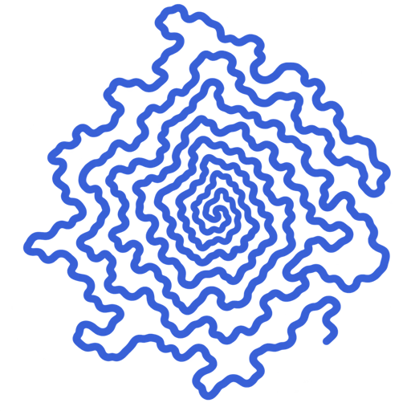

# Squiggles

<picture>
  <source media="(prefers-color-scheme: dark)" srcset="apps/web/public/logo-dark.png" />
  
</picture>

A local-first Strava explorer. Compile an export into GeoParquet, open it directly in a Chromium browser, render routes, and use DuckDB SQL to create persistent map tabs. Local mode keeps activity data on the machine; the optional hosted path publishes an explicitly selected compiled dataset for unlisted sharing.

## Intent

Squiggles is for understanding and telling the story of a large activity archive—not planning a route, navigating, coaching a workout, or recreating a social feed. It aims to stay interactive at a scale that is difficult to inspect activity-by-activity in Strava or to import as thousands of individual GPX files into route-planning experiences such as Caltopo.

The project is a success if it helps someone discover years of movement and eventually hear: “No, Grandpa, I don't want to see your heatmap again.” Click or hover the application logo for the in-app version of this story.

## Requirements

- Python 3.12 or 3.13 and `uv`
- Node.js 22+ and `pnpm` 11.22

## Compile

ZIP archives and extracted exports are accepted. Do not use an archive that is still downloading.

```bash
uv run squiggles compile-strava ../mvmt/data/export_10947978_extracted --output data/local/mvmt
uv run squiggles validate data/local/mvmt
```

FIT, GPX, and TCX files, including gzip variants, are supported. Recoverable failures go to `rejections.parquet`; output under `data/local/` is ignored by Git.

The default output Hive-partitions by `activity_family`; `start_year` and `start_month` remain available to DuckDB as normal columns. Inside each family, the compiler Morton-orders route bbox centers across all years, writes 128-row Parquet groups inside 512-row spatial shards, and records both shard and row-group conservative bboxes in the manifest. The larger files and groups minimize mobile URL/footer/range-request fan-out while DuckDB still prunes four spatial groups in a full shard. Use `--target-shard-rows` and `--row-group-rows` to tune the two levels independently.

## Explore locally

```bash
pnpm install --frozen-lockfile
pnpm dev
```

Open the local URL in Chrome or Edge, choose **Dataset**, and select `data/local/mvmt`. No API server or map key is required. Streets, topographic, and imagery basemaps use public network tile services; choose **Blank / offline** to make no basemap requests. The query toolbar is hidden by default; click the active tab to show or hide it. Cmd/Ctrl+Enter runs SQL, and new tabs open the toolbar automatically. Pan and zoom query intersecting route bboxes and select an overview under both a zoom fidelity ceiling and a system resolution budget. Low, Medium, and High permit 250k, 750k, and 1.25M visible vertices; coarse-pointer devices default to Low and desktops to Medium. LOD transitions occur at zooms 8, 12, 14, and 16, and dense views downgrade automatically. Normal, heat, hover, and selected strokes thin continuously after zoom 12 so they do not obscure streets and trail corners at maximum zoom. Hover any query parameter for its short explanation.

Route heat is computed on demand from the current query and viewport without changing the geometry chosen by the LOD planner. Every selected vertex contributes to a screen-space grid; each route receives one score from cross-activity vertex pairs in its cell and the eight neighboring cells, then keeps one color along its complete path. Own-route vertices cannot heat themselves. Choose Sunset, Viridis, Fire, or Ice and adjust Temperature: higher values make moderately shared routes saturate sooner on the logarithmic scale. Hovering emphasizes an entire route; selecting it opens its elevation profile, and hovering the profile traces the corresponding position on the map.

The application accent, default route, elevation trace, and profile marker use blue `#476BCC`. Heat palettes retain their semantic multi-color ramps. Existing tabs that still contain one of the former built-in accent colors migrate automatically; intentional custom route colors are preserved. The header, statistics, README, and browser icon choose the blue logo in light mode and the white logo in dark mode.

The shared desktop/mobile header contains the current-query dropdown and a right-aligned state dot. That dropdown selects and creates saved queries and opens Query settings, **Statistics**, **Table**, **Rendering**, Dataset, AI Skills, and System settings. Statistics, Table, and Rendering open as resizable right drawers on desktop and resizable bottom sheets on mobile. Statistics shows totals, averages, activity days, cleaning counts, and activity-family counts. Table loads lightweight metadata and bounds for every activity in the current SQL selection, sorts by activity, sport, date, distance, gain, or maximum elevation, and zooms to a route before opening its full detail. Rendering reports candidate/total shards, the actual LOD/raw representation, zoom, route and vertex counts, geometry latency, line width, heat work, data view, and basemap. Theme and units persist locally; display units default to miles unless a stored preference or deep link selects kilometres. Canonical SQL units remain metres and seconds.

The SQL editor provides syntax highlighting, activity-column autocomplete with Ctrl+Space, line editing, and starter queries for common activity, time, distance, and elevation selections. It remains ordinary editable DuckDB SQL. Switching saved tabs executes the new tab's SQL; clicking the active tab only toggles the sectioned query/settings drawer. Visual controls apply immediately, Clean automatically refreshes the last applied SQL, and an edited SQL draft changes results only through the visible Run button. The editor is loaded only when query controls are opened, and neither SQL nor schema completion leaves the browser.

Use **AI Skills** to copy the complete relation contract into a natural-language SQL assistant, or read [the query schema](docs/query-schema.md). The included **Runs above 12k ft** example tab demonstrates filtering nested track points. When **Clean** changes, the worker automatically projects the precompiled clean geometry, summaries, bounds, point count, and filtered telemetry into the normal `activities` columns before rerunning the last applied SQL; an unsaved SQL draft remains untouched. It reconnects valid neighbors around isolated spikes without fabricating telemetry or changing the canonical files. Independently, the renderer refuses to draw a straight segment across a coordinate gap over 20 km.

During development, an ignored dataset under `data/local/` can be opened through Vite with HTTP range reads by naming its directory in the URL:

```text
http://localhost:5173/?dataset=mvmt&tab=example-high-runs
```

For the current local acceptance dataset, use `?dataset=strava`. **Copy tab link** preserves the active local tab, camera, basemap, heat palette/temperature, cleaning state, route color, and display units. Map movement updates these URL parameters without adding browser-history entries. Custom tab SQL must already exist in that browser because SQL and activity data are deliberately excluded from the URL; this is local deep-linking, not hosted sharing. The developer dataset route is available only from Vite and does not bundle or copy the dataset.

All activity reads, SQL, summaries, viewport pruning, LOD planning, and detail lookup run in DuckDB-Wasm in a Web Worker. Heat preparation and route rendering run in the browser with deck.gl/WebGL; there is no application API or persistent process to host. A static deployment only needs the application assets and GeoParquet files with byte-range support. Network basemaps are the sole runtime third-party requests, and Blank / offline removes those too.

## Hosted deployment

The first hosted slice uses Pulumi-managed private S3 origins and one CloudFront distribution for the static Vite application and `/datasets/*`. The selected public hostname is `squiggles.io`; the generated CloudFront hostname remains available during DNS rollout. DuckDB and rendering remain in the browser, and `/m/<dataset-uuid>` opens the manually uploaded developer dataset. Authentication and managed uploads intentionally follow later.

Use native Pulumi commands for infrastructure—there are no Make or pnpm deployment wrappers:

```zsh
cd infra/aws
AWS_PROFILE=squiggle-dev pulumi preview --stack dev
AWS_PROFILE=squiggle-dev pulumi up --stack dev
```

See [the AWS runbook](infra/aws/README.md) for one-time local Pulumi/AWS setup, budget email configuration, manual dataset upload, range-request acceptance, and destruction safety. No cloud resources are created by installation, build, test, or preview-free development commands.

Pull requests and pushes to `main` run Python, web, infrastructure, and secret checks. A successful `main` build deploys through GitHub OIDC without stored AWS access keys, then semantic-release derives a GitHub release from Conventional Commit messages. The deployment role cannot change its own trust or permissions; those bootstrap changes require a reviewed local Pulumi update.

The scale path is deliberately columnar: the compiler turns many source files into partitioned GeoParquet; DuckDB-Wasm scans only required Parquet columns and viewport rows; and interleaved GeoArrow coordinate buffers transfer directly into deck.gl's binary `PathLayer` without a GeoJSON or per-point JavaScript-object expansion. Successfully encountered viewport batches stay in an adaptive 256 MiB–1 GiB in-memory LRU and are reused when the same view returns. GPU upload is still required, but the large intermediate object graph is gone. That division lets a user's browser interact with many millions of recorded points without uploading the archive or asking a route planner to manage thousands of independent GPX layers.

## Verify

```bash
uv run pytest
uv run ruff check .
uv run mypy
pnpm lint
pnpm test
pnpm typecheck
pnpm build
```

See [architecture](docs/architecture.md), [data model](docs/data-model.md), and [decisions](docs/decisions.md).
